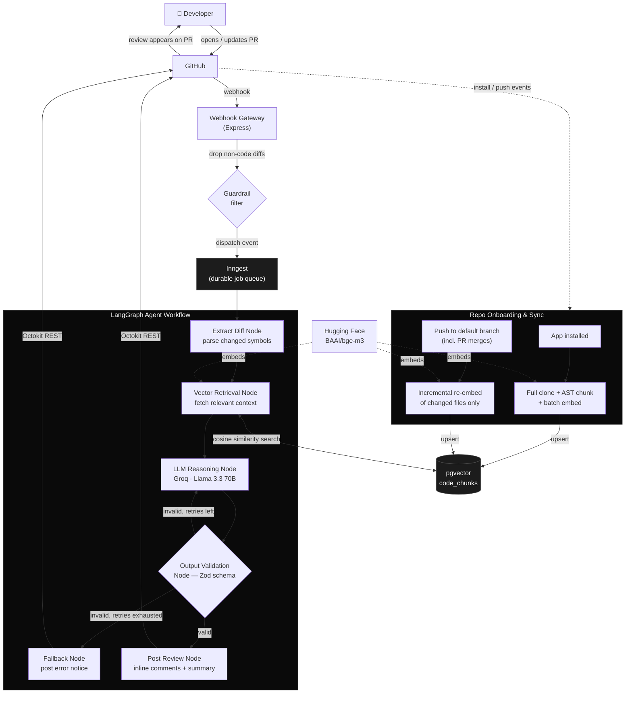

<div align="center">


# CommitBear

**A senior engineer that never sleeps, never rate limits your team, and reviews every PR in seconds.**

[](#)
[](#)
[](#license)
[](#)

[Getting Started](#getting-started) · [How It Works](#how-it-works) · [Architecture](#architecture) · [Roadmap](#roadmap)

</div>

<br />

## The problem

Code review doesn't scale with team size. Senior engineers spend hours a week reading diffs instead of shipping. Junior PRs sit for a day waiting on a reviewer. Context that lives in one person's head such as *"we tried that pattern in `auth/`, it broke prod"*  never makes it into the review at all.

## What CommitBear does

CommitBear installs on a repo like any other GitHub App. From then on, **every pull request gets reviewed automatically**  not by a stateless LLM glancing at a diff but by an agent that retrieves the actually relevant parts of your codebase first, reasons over the change with that context, validates its own output against a strict schema, and posts inline comments and a risk summary straight to the PR. If it can't produce a trustworthy review, it says so instead of guessing.

No dashboards to check. No copy pasting diffs into a chat window. It just shows up in your PRs.

<br />

## How it works

1. **You install the app** on a repo. CommitBear clones it once, chunks the source with AST aware parsing, embeds every chunk, and stores it in a vector index.
2. **Someone opens a PR.** A webhook fires, CommitBear pulls the diff, and extracts the symbols that actually changed.
3. **It retrieves relevant context** — not the whole repo, just the functions and modules the diff touches or depends on.
4. **An LLM reasons over [diff + context]** and produces a structured review: a risk rating, an approval recommendation, and inline comments.
5. **The output is validated against a strict schema.** If it's malformed, CommitBear retries with the validation errors fed back in  up to 3 times before falling back gracefully instead of posting garbage.
6. **The review is posted to GitHub** as inline comments plus a summary, the same way a human reviewer would leave one.
7. **Every merge keeps the index fresh.** Pushes to the default branch trigger an incremental re sync of just the changed files, so CommitBear's understanding of your codebase never goes stale.

<br />

## Architecture



<br />


## Tech stack

- **Runtime** — Node.js 24, TypeScript (strict, ESM)
- **Webhook Gateway** — Express + `@octokit/webhooks`
- **Job Orchestration** — Inngest
- **Agent Orchestration** — LangGraph.js (`@langchain/langgraph`)
- **Vector Store** — PostgreSQL + `pgvector` (HNSW index)
- **Embeddings** — Hugging Face Inference API
- **Code Parsing** — `@ast-grep/napi`
- **LLM** — Groq
- **Validation** — Zod
- **GitHub Integration** — Octokit (REST + App auth)

<br />

## Getting Started

```bash
npm install
cp .env.example .env      # fill in DB / GitHub App / HF / Groq credentials
npm run migrate            # sets up pgvector schema
npm run build && npm start
```

Then create a GitHub App, subscribe it to **Pull request**, **Installation**, **Installation repositories**, and **Push** events, and install it on a repo. See [`SETUP.md`](./SETUP.md) for the full walkthrough — from creating the app to your first automated review.

<br />

## License

MIT — see [`LICENSE`](./LICENSE).

<br />

<div align="center">
<sub>Built for teams who'd rather ship than wait for review.</sub>
</div>
